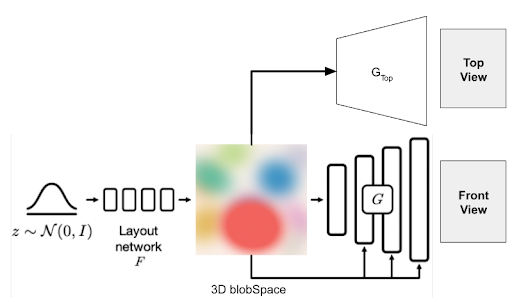

## BlobGAN-3D : Experiment 3

### Generating Top and Front view from a 3D-Blobspace

#### In this experiment, we replace the above two discriminators with a single discriminator which takes stacked real image (top & front view) as input.
##### Note : 2 optimizers, 1-Generator (Top & Front) & 1-Discriminator are used as compared to 3 optimizers used before 